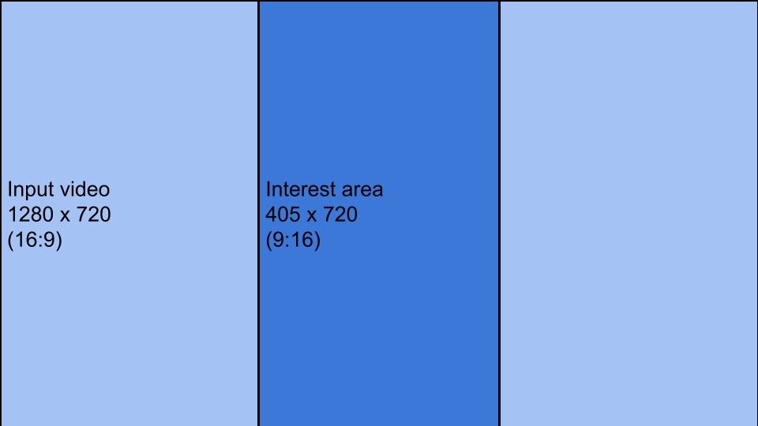

# social-feed-ai-replay
Social Feed AI is a tool to convert a horizontal video (1280 x 720) to a vertical video that is mobile friendly.

The chalange is how to crop the video in a way that the content of the video replay is preserved.

To solve this chalange the tools uses a YOLOv8 pretrained network to detect the sports ball and use its location in the video to perform the transformations.



# Usage

Use pip to install the dependencies
```
pip install -r requirements.txt
```

Then run the tool with:
```
python3 convert.py <path to the input video> 
```

Running the sample video
```
python3 convert.py ./samples/sample-01.mp4
```

The resulting video is going to be saved at `results` folder
